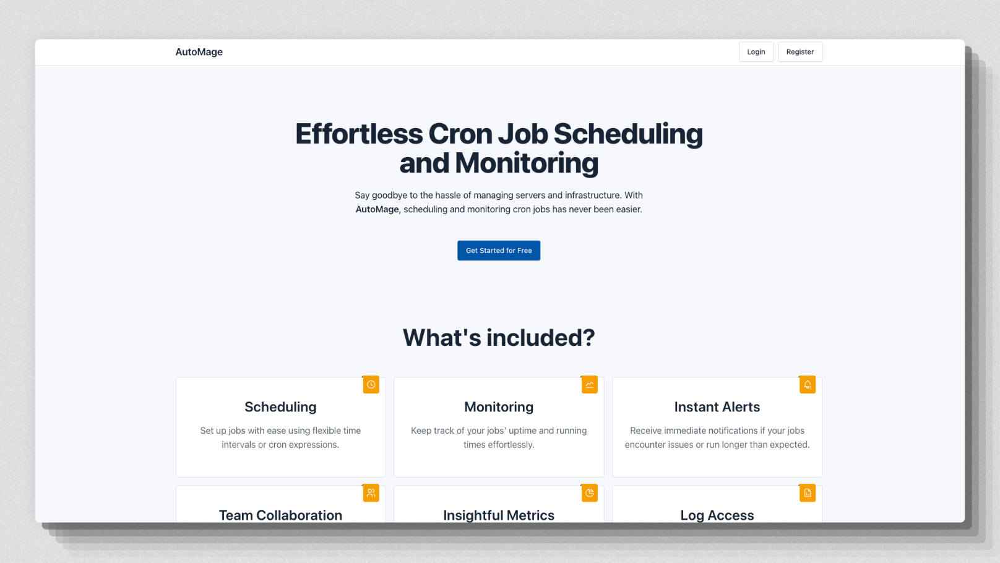

# AutoMage

Cronjobs scheduler with django.



## Run Migrations

```bash
python manage.py migrate
```

## Run scheduler

Run celery worker.

```bash
celery -A automage worker -l INFO
```

Run celery beat scheduler
```bash
celery -A automage beat --scheduler django_celery_beat.schedulers:DatabaseScheduler
```
